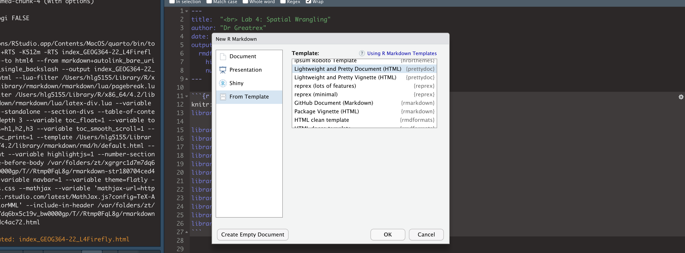
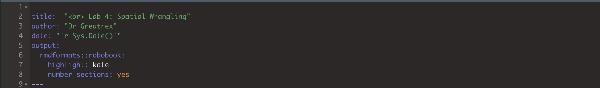

```{r setup, include=FALSE}
knitr::opts_chunk$set(echo = TRUE, warning=FALSE, message = FALSE)
library(kableExtra)

library(tidyverse)
library(dplyr)
library(ggpubr)
library(skimr)
library(ggplot2)
library(plotly)
library(knitr)
library(raster)
library(sp)
library(sf)
library(tmap)
library(terra)
library(rnaturalearth)

library(biscale)
library(tidycensus)
library(cowplot)
library(units)
```

<br>

# OVERVIEW

------------------------------------------------------------------------

## Learning Objectives

The aim of this week's lab is a NORMAL TWO WEEK LAB (sorry for the confusion). We will focus on using Census data

SEE CANVAS FOR SUBMISSION DATES.

## Get help

If a link to a tutorial is broken, you should be able to go to the tutorial number and find it in the menu.

Teams is the fastest way to get help. [CLICK THIS LINK FOR THE TEAMS
WEBSITE FOR LAB
HELP](https://teams.microsoft.com/l/team/19%3aSt_BHDOZLAgR9dsxgB2ly3-O77CnxyzoGFVYc0fpUTM1%40thread.tacv2/conversations?groupId=5e74a2d7-3a10-409a-b38d-50875fd02455&tenantId=7cf48d45-3ddb-4389-a9c1-c115526eb52e)

<br>

# LAB SET-UP

<br>

## Create a project

-   Using R-CLOUD? : click here. This also has instructions on uploading/downloading code from your computers. 
    <https://psu-spatial.github.io/Geog364-2022/index_GEOG364-22_Tutorial_R.html#2_R-Studio_CLOUD>
    <br><br>
-   Using YOUR LAPTOP? : Click here: -
    <https://psu-spatial.github.io/Geog364-2022/index_GEOG364-22_Tutorial_R.html#3_R-Studio_Desktop>

<br>

## Use a template

You are welcome to use your own template, but I suggest for ease using
one of the professional ones, such as `PACKAGE rmdformats` or
`PACKAGE prettydoc`. To use these,

-   (if you have not already) click on the packages tab, then the
    install button. Install the `rmdformats` package and the `prettydoc`
    package.<br><br>
-   Same as normal, go to *File\|New File\|R Markdown*. But NOW, click
    on the templates button on the left. <br><br>
-   You will see a whole load of templates from the different packages.
    Each will give you professional formatting for very little work. To
    explore what they look like without having to try each one, google
    the websites for rmdformats, prettydoc and others..<br><br>

```{r, Lab4Fig1,fig.align='center', fig.height=3, echo=FALSE}

```

-   To see what a template looks like, choose it, press OK, then press
    knit. <br><br>

-   Choose your favourite. Finally, remember to add in the title and
    author lines at the top of your Rmd file. For example here is the
    final YAML for this script.<br><br>

```{r, Lab4Fig2,fig.align='center', fig.height=3, echo=FALSE}

```

<br>

## Add libraries & code options

Edit the first "set-up" code chunk so it looks like this and run/knit to
load. You might need additional libraries as you work through the lab.
If so, add them in this code chunk AND REMEMBER TO RERUN. If you're
template didn't have a "setup" code chunk, just create one at the top.

If you see a little yellow bar at the top asking you to install
them,click yes!

```{r, eval=FALSE}

knitr::opts_chunk$set(cache = TRUE,message=FALSE,warning=FALSE,echo=TRUE)

# LIBRARIES
library(tidyverse)
library(dplyr)
library(ggpubr)
library(skimr)
library(ggplot2)
library(plotly)
library(knitr)
library(raster)
library(sp)
library(sf)
library(tmap)
library(terra)
library(rnaturalearth)
library(biscale)
library(tidycensus)
library(cowplot)
library(units)
```

<br><br>

# USING CENSUS DATA

Work through TUTORIAL 11, getting the code working in your lab report.
It will show you how to download and use data from the US census and
American Community survey.

[add link, for now to go to the Tutorials tab]

1.  Choose ANY US STATE that is NOT Iowa or PA. Choose a different one
    to your friends. Also, choose some additional variables that
    interest you. For example, past students have looked at water
    poverty (access to sanitation), access to broadband, demographics
    and crime etc. <br>

2.  Edit your code so that it works for your new combination. <br>

3.  Make 3 maps, including at least one bichloropleth (same tutorial)
    that show something interesting about your state. Write a few
    sentences under each one interpreting your results. <br> Bonus marks
    for something that's genuinely interesting, rather than just two
    random variables you decided on. <br><br> If you want to continue to
    improve your tmap chloropleths.
    <https://rpubs.com/erikaaldisa/choroplethmapping> There are also
    some good interactive ones out there on R graph gallery.

4.  Explain the modifiable areal map problem and both the shape and zone
    effects. Write what impacts of MAUP do you think you see in your
    analyses and why. E.g. "Iowa City is dominating the county its
    in).<br>

5.  Explain what a chloropleth map is and a bi-chloropleth map.

6.  Chloropleths can be difficult to interpret because of both MAUP and
    the color scales. In the bi_class function you just used, there are
    four types of color scale possible: "quantile", "equal", "fisher",
    and "jenks". Using the internet as a resource (or the textbooks),
    summarise what each of them is doing. Choose the most appropriate
    one for your particular analysis and explain your choice. <br><br>
    [[HINT: These links might be useful, but remember to answer in your
    own words -
    <https://gisgeography.com/choropleth-maps-data-classification/>] and
    <https://darribas.org/gds18/slides/lecture_04.pdf>]

7.  Look at the best practice for chloropleths:
    <https://blog.datawrapper.de/choroplethmaps/> and make a new version
    of one of your plots with at least one improvement, explaining what
    you did. If you can't get it working, you can get most of the marks
    for explaining what you WANTED to do.

# BASIC STATS RECAP

In the second part of the course, we will do some more maths. This is
your chance to hvae a recap

Go to this Khan Academy website

-   <https://www.khanacademy.org/math/ap-statistics/xfb5d8e68:inference-categorical-proportions>

Work through the materials at your leisure,

For this lab, take:

-   QUIZ PROPORTIONS 2:
    <https://www.khanacademy.org/math/ap-statistics/xfb5d8e68:inference-categorical-proportions/quiz/xfb5d8e68:inference-categorical-proportions-quiz-2>
    (5 questions, 10 MARKS)

-   QUIZ PROPORTIONS 3:
    <https://www.khanacademy.org/math/ap-statistics/xfb5d8e68:inference-categorical-proportions/quiz/xfb5d8e68:inference-categorical-proportions-quiz-3>
    (5 questions, 10 MARKS)

Then go to this website:

-   <https://www.khanacademy.org/math/ap-statistics/xfb5d8e68:inference-quantitative-means>

work through the materials at your leisure, and take these two quizzes.

-   QUIZ MEANS 1:
    <https://www.khanacademy.org/math/ap-statistics/xfb5d8e68:inference-quantitative-means?referrer=upsell#>:\~:text=Practice-,Quiz%201,-Level%20up%20on
    (5 questions, 10 MARKS)

-   QUIZ MEANS 2:
    <https://www.khanacademy.org/math/ap-statistics/xfb5d8e68:inference-quantitative-means/quiz/xfb5d8e68:inference-quantitative-means-quiz-2>
    (5 questions, 10 MARKS)

FOR ALL 4, INCLUDE SCREENSHOTS IN YOUR LAB REPORT OF YOUR SCORES.

Each quiz should have 5 questions e,g, 20 in all. You can take the
quizes as many times as you like, but you drop 2 marks for each question
you get wrong in your final screenshots.

# ABOVE & BEYOND

To get the 4 marks CHOOSE ONE of these options:

-   Work out how to put tables in markdown and include your Khan scores
    as a neatly formatted table (look at Kable)

-   Work out how to put equations in markdown text and include a fancy
    equation of your choice

<br>

# SUBMITTING YOUR LAB

Remember to save your work throughout and to spell check your writing
(next to the save button). Now, press the knit button again. If you have
not made any mistakes in the code then R should create a html file in
your Lab folder which includes your answers.

<br> <br>

# CHECK THIS BEFORE YOU SUBMIT!

People who use this section get better grades...

## Predict your grade

Here is LITERALLY how we are grading you. Predict your grade!

**HTML FILE SUBMISSION - 8 marks**

**RMD CODE SUBMISSION - 8 marks**

**MARKDOWN/CODE STYLE - 10 MARKS**

Your code and document is neat and easy to read. LOOK AT YOUR HTML FILE
IN YOUR WEB-BROWSER BEFORE YOU SUBMIT. There is also a spell check next
to the save button. You have written your answers below the relevant
code chunk in full sentences in a way that is easy to find and grade.
For example, you have written in full sentences, it is clear what your
answers are referring to.

**CHLOROPLETH PART - 40 MARKS**

-   Make maps for your state [10]

-   Interpret them for your state [10]

-   MAUP explanation [10]

-   Explaining breaks/jenks etc [5]

-   Best practice [5]

**KHAN ACADEMY - 30 MARKS**

-   lose 2 for each incorrect question

**Above and beyond: 4 MARKS**

See above

[100 marks total]

## What your grade means

Why is 100% hard? Overall, here is what your lab should correspond to:

```{r, echo=FALSE}
rubric <- readxl::read_excel("index_GEOG364_22_LRubric.xlsx")
knitr::kable(rubric) %>%   
  kable_classic_2() %>%
  kable_styling(bootstrap_options = c("striped", "hover", "responsive"))


```
