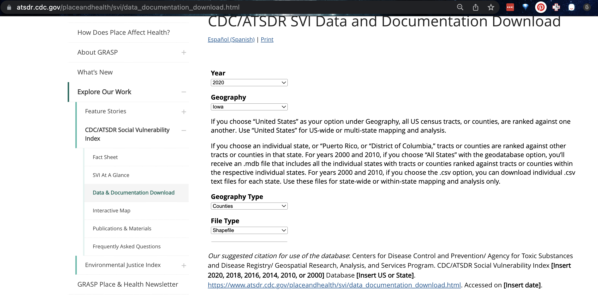

```{r setup, include=FALSE}
knitr::opts_chunk$set(echo = TRUE, warning=FALSE, message = FALSE)
library(kableExtra)

library(tidyverse)
library(dplyr)
library(ggpubr)
library(skimr)
library(ggplot2)
library(plotly)
library(knitr)
library(raster)
library(sp)
library(sf)
library(tmap)
library(terra)
library(rnaturalearth)

library(biscale)
library(tidycensus)
library(cowplot)
library(units)
```

<br>

# OVERVIEW

------------------------------------------------------------------------

## Learning Objectives

The aim of this week's lab is to look at SOVI and Moran's I data.

SEE CANVAS FOR SUBMISSION DATES.

## Get help

If a link to a tutorial is broken, you should be able to go to the tutorial number and find it in the menu.

Teams is the fastest way to get help. [CLICK THIS LINK FOR THE TEAMS
WEBSITE FOR LAB
HELP](https://teams.microsoft.com/l/team/19%3aSt_BHDOZLAgR9dsxgB2ly3-O77CnxyzoGFVYc0fpUTM1%40thread.tacv2/conversations?groupId=5e74a2d7-3a10-409a-b38d-50875fd02455&tenantId=7cf48d45-3ddb-4389-a9c1-c115526eb52e)

<br>

# LAB SET-UP

<br>

## Create a project

-   Using R-CLOUD? : click here. This also has instructions on uploading/downloading code from your computers. 
    <https://psu-spatial.github.io/Geog364-2022/index_GEOG364-22_Tutorial_R.html#2_R-Studio_CLOUD>
    <br><br>
-   Using YOUR LAPTOP? : Click here: -
    <https://psu-spatial.github.io/Geog364-2022/index_GEOG364-22_Tutorial_R.html#3_R-Studio_Desktop>

<br>

## Use a template

You are welcome to use your own template, but I suggest for ease using
one of the professional ones, such as `PACKAGE rmdformats` or
`PACKAGE prettydoc`. See the start of Lab 5 for instructions on how to do this.

<br>

## Add libraries & code options

NOTE, I HAVE SPLIT THESE CODE CHUNKS IN TWO FOR THEM TO WORK BETTER. PLEASE DO THIS.

Edit the first "set-up" code chunk so it looks like this and run/knit to
load. You might need additional libraries as you work through the lab.
If so, add them in this code chunk AND REMEMBER TO RERUN.

If you see a little yellow bar at the top asking you to install
them,click yes!

```{r, eval=FALSE}
# SET UP
knitr::opts_chunk$set(cache = TRUE,message=FALSE,warning=FALSE,echo=TRUE)
```


```{r, eval=FALSE}
# LIBRARIES
library(tidyverse)
library(dplyr)
library(ggpubr)
library(skimr)
library(ggplot2)
library(plotly)
library(knitr)
library(raster)
library(sp)
library(sf)
library(tmap)
library(terra)
library(rnaturalearth)
library(biscale)
library(tidycensus)
library(cowplot)
library(units)
```

<br>


# LAB OVERVIEW (READ THIS)

There are lots of data-sets out there on vulnerability, so in a weather disaster it is important to know which one to turn to.  One common task I did as a data analyst was to create "cheat sheets" of important datasets.

You are a junior consultant.  You have been asked for an assessment of the Social Vulnerability Index (SVI) data for hurricane evacuations and to assess if vulnerability is clustered. You have been assigned 5-6 hrs salary on the analysis and keep reading for more information. 

#### Readers of your report

The readers of the report are:

 - The Red Cross US analyst Andrew Kruczkiewicz   https://old.climatecentre.org/about-us/our-people <br>
 - Dr Julita Chasco,Technical Coordination officer for the World Meteorological officer and ex-lead of the Head of Meteorology and Society Department at the Argentinian met service https://twitter.com/julitachasco <br>
 
I know this people in real life and will share exceptional reports with them! Your report readers know a lot about vulnerability, but very little about spatial statistics or this specific dataset.

 
## Start your write up

The Social Vulnerability Index (SVI) indicates the relative vulnerability to hazardous events. Read these two pages:

  - https://www.atsdr.cdc.gov/placeandhealth/svi/fact_sheet/fact_sheet.html
  - https://www.atsdr.cdc.gov/placeandhealth/svi/at-a-glance_svi.html

The full documentation with an explanation of the four themes can be found here:

 - https://www.atsdr.cdc.gov/placeandhealth/svi/documentation/pdf/SVI2020Documentation_08.05.22.pdf

### Describe the dataset

Make a report heading called "SVI Data Overview"

Set a timer for around 30 mins.  Create a summary of the dataset for your readers. You can use whatever report structure you like - you're welcome to pictures/tables/bullet point lists etc as useful.

Basically please make it as easy as possible for Mr Kruczkiewicz and Dr Chasco to understand - please use use sub-headings!  

 - What is the dataset?
 - Who made it?  How?
 - How do the dataset owners suggest it might be useful.
 - How often is the dataset published/updated?
 - What are each of the four themes?  How are they calculated?
 - How should you cite this dataset (google citation SVI data, or on the data download page)

### Example of research/use

Make a report heading called "SVI use example"

Summarise (about 5-6 sentences/paragraph) one example where SVI data has been used to support hurricane response.    This should summarise what the example did, who did it and what they found out. You should also include a citation.

Your example can either be a research paper or an operational case study  Either choose one from here, https://www.atsdr.cdc.gov/placeandhealth/svi/publications/publications_materials.html or alternately google things like **"red cross" "SVI" hurricane**.


## Download the data

In this report, you  have to show an example analysis of how the data can be used.  

1. Go to the data download page:

 a. https://www.atsdr.cdc.gov/placeandhealth/svi/data_documentation_download.html

2. Hurricane states are FL, GA, LA, MS, NC, SC and TX.  Choose a state that is different to your friends. On R studio cloud, choose one of the smaller ones.

3. Download 2 zip files for BOTH the census tract and county scales. 

```{r, svi, echo=FALSE, fig.cap = "DOWNLOAD TWO ZIP FILES"}

```


4. Make a sub-heading called Data Download.  Follow this tutorial to read it into your report and change it into an appropriate projection. https://psu-spatial.github.io/Geog364-2021/pg_364Lab6_moran_2021.html#Read_the_data_into_R

5. Make sure to include an appropriate citation!
 
### Explain how to download.read in the data

Your report readers will also need to access the data. Your readers have basic R knowledge, but they're pretty rusty. 

Write a mini tutorial on how to access and download the data, and how to read it into R and change the projection.

This should include things like which packages/code you need, what the download options are on the form, and how to cite the data when you have it. Bonus for common troubleshooting issues (but remember this is only 10 marks..)

###


 
 
 
 


# ABOVE & BEYOND

To get the 4 marks CHOOSE ONE of these options:

-   Work out how to put tables in markdown and include your Khan scores
    as a neatly formatted table (look at Kable)

-   Work out how to put equations in markdown text and include a fancy
    equation of your choice

<br>

# SUBMITTING YOUR LAB

Remember to save your work throughout and to spell check your writing
(next to the save button). Now, press the knit button again. If you have
not made any mistakes in the code then R should create a html file in
your Lab folder which includes your answers.

<br> <br>

# CHECK THIS BEFORE YOU SUBMIT!

People who use this section get better grades...

## Predict your grade

Here is LITERALLY how we are grading you. Predict your grade!

**HTML FILE SUBMISSION - 8 marks**

**RMD CODE SUBMISSION - 8 marks**

**MARKDOWN/CODE STYLE - 10 MARKS**

Your code and document is neat and easy to read. LOOK AT YOUR HTML FILE
IN YOUR WEB-BROWSER BEFORE YOU SUBMIT. There is also a spell check next
to the save button. You have written your answers below the relevant
code chunk in full sentences in a way that is easy to find and grade.
For example, you have written in full sentences, it is clear what your
answers are referring to.

**CHLOROPLETH PART - 40 MARKS**

-   Make maps for your state [10]

-   Interpret them for your state [10]

-   MAUP explanation [10]

-   Explaining breaks/jenks etc [5]

-   Best practice [5]

**KHAN ACADEMY - 30 MARKS**

-   lose 2 for each incorrect question

**Above and beyond: 4 MARKS**

See above

[100 marks total]

## What your grade means

Why is 100% hard? Overall, here is what your lab should correspond to:

```{r, echo=FALSE}
rubric <- readxl::read_excel("index_GEOG364_22_LRubric.xlsx")
knitr::kable(rubric) %>%   
  kable_classic_2() %>%
  kable_styling(bootstrap_options = c("striped", "hover", "responsive"))


```
