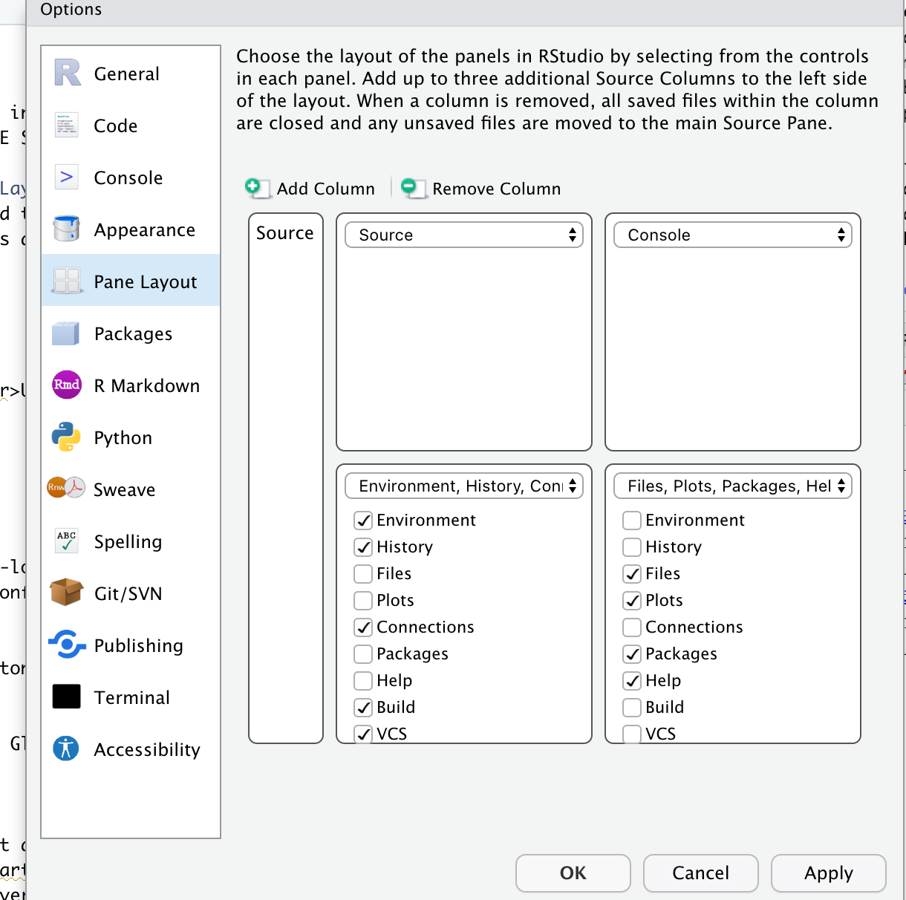
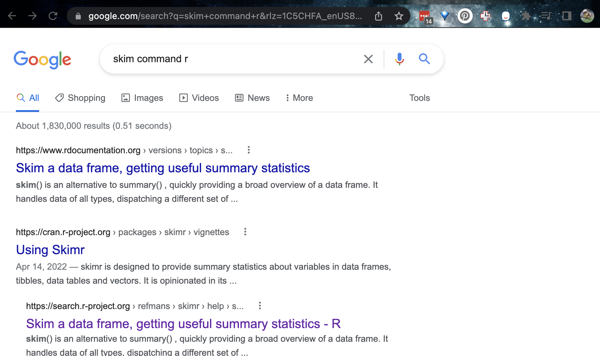

```{=html}
<style>
p.comment {
background-color: #DBDBDB;
padding: 10px;
border: 1px solid black;
margin-left: 25px;
border-radius: 5px;
font-style: italic;
}
</style>
```

```{r setup, include=FALSE}
# OPTIONS -----------------------------------------------
knitr::opts_chunk$set(echo = TRUE, 
                      warning=FALSE, 
                      message = FALSE)

# PACKAGES-----------------------------------------------
# Tutorial packages
library(vembedr)
library(skimr)
library(yarrr)
library(RColorBrewer)
library(GGally) 
library(tidyverse)
library(plotly)
library(readxl)
library(rvest)
library(biscale)
library(tidycensus)
library(cowplot)
library(units)


# FUNCTIONS -----------------------------------------------
# Get R version
GetRLatest <- function(Website="https://cran.r-project.org/banner.shtml"){
   require(rvest)
   
   #scrape the text from the website
   RWebsite <- read_html("https://cran.r-project.org/banner.shtml") %>%
            html_nodes("li") %>%
            html_text()
   
   # get the line that includes latest release and get rid of the stuff after
   RLatest <- base::strsplit(RWebsite[grep("latest release",
                                     tolower(RWebsite))],"\n")[[1]][1]
   return(RLatest)
}

```

<br> <br>

# READ THIS FIRST

In these labs, you can either use your own laptops/computers, or you can
use a website called R-studio cloud on ANY computer. They do basically
the same thing and you can switch between the two.

-   DESKTOP: Means do this if you are using your own computer <br><br>
-   CLOUD: Means do this if you are using the website

<br> <br>

## All about R {.tabset .tabset-fade}

### R is a LANGUAGE {.unnumbered}

**R** is a free, open source statistical programming language. It is
useful for data cleaning, analysis, and visualization.

By a "programming language", I mean it is a collection of commands that
you can type into the computer in order to analyse and visualise data.

The easiest way I find to think about R is that it is literally a
language, like Spanish or Hindi, that is spoken by your computer.
Learning R means learning vocabulary and grammar in order to
communicate. It also means it will get easier with experience and
practice..

<br>

### The "VERSION" of R you use is important! {.unnumbered}

Just like English has changed since Shakesperean times, the R language is always evolving. We keep track using Versions. For example, in the screenshot above, at the top of the console you can see it was made with
`R version 4.1.0 Camp Pontanzen`

*To make sure we are all on the same page, we need the most up-to-date version of the R commands.*

The version of R I am using is :

```{r,echo=FALSE}
paste(R.version$version.string,R.version$nickname,sep=" ")
```

As long as yours is above that you should be fine. The current most recent version of the language on the website is:

```{r, echo=FALSE}
GetRLatest()
```

<br><br>

## All about R-Studio {.tabset .tabset-fade}
### R-STUDIO is a PIECE OF SOFTWARE {.unnumbered}

**R-studio** is piece of software designed to make it easier to
communicate/programme in R, just like Microsoft word is designed to make
it easier to communicate in 'human'.

Just like word, it has many cool features. For example, you can easily
see help files, run code, see your output and create outputs like this
lab book! R-Studio also allows us to make interactive documents called
R-Markdown files. We shall discuss this more in the
TUTORIAL-LINK-MARKDOWNTUTORIAL.

In fact this lab-book is written in R-Markdown

<br>

```{r, Tut_Fig2, echo=FALSE, fig.cap = "*R-studio is much more sophisticated*",fig.align='center'}
knitr::include_graphics('./Figures/Tut_Fig2_markdown.png')
```

<br>

### TO DO! Watch this {.unnumbered}

Watch this 1 minute video on R-Studio:
<https://www.rstudio.com/products/rstudio/>

Or, if you prefer, this 5 minute video

```{r,echo=FALSE,fig.align='center'}
embed_url("https://www.youtube.com/watch?v=SdMPh5uphO0")
```

<br>


# R-Studio CLOUD {.tabset .tabset-fade}

<br>

**These tabs tell you all you need to know about running R-Studio on the Cloud website:** 

   - **What is the cloud**
   - **Creating a project**
   - **Downloading and uploading files from the cloud website**
      + (Important so you can submit your labs!)

<br>

## About R-Studio Cloud {-}

The easiest way to get R-studio is to simply to use the R-Studio Cloud
website

Here you can log into an online version of R. and I believe is free for
the first 25hrs each month. Like Jupiter Notebook, you can also
programme in other langauges.

-   Advantages:
    -   Super Easy. You will never have to worry about versions or
        updating.
    -   Projects are incredibly easy and I can debug things fast
    -   You can do your labs anywhere you have access to a webpage
        <br><br>
-   Disadvantages:
    -   It's not as powerful, you won't be able to play will millions of
        data points
    -   You have to be online; bad internet connections make it harder


To sign up, make an account at <https://rstudio.cloud/plans/free>, then
click the tabs here to look around. Sadly there is no student pricing
right now.

<br>
<br>


## Projects using the cloud {-}

[](https://www.linkedin.com/learning/learning-the-r-tidyverse/why-should-you-use-projects-in-rstudio?u=76811570)

An R-project is a folder that will store everything to do with each lab
in one place on your computer. This is incredibly useful - it means that
if you switch from R-Cloud, to the lab computers, to your laptop, all
you have to do is to move the folder and everything will just work.
Learn more here.  You will have a project for each Lab and I may share projects with example code.

### Creating a lab project {-}

Once you have logged in, you will get to a dashboard like this, called
the R-studio workspace. You make a new project by clicking the button on
the top right. You can open different projects in different tabs on your
browser. You can also go back to the work-space at any time.

You can get here from any web-browser, You do not need a special
computer.

```{r, Tut_Fig4, echo=FALSE, fig.cap = "*The Cloud dashboard*",fig.align='center'}
knitr::include_graphics('./Figures/Tut_Fig4_clouddash.png')
```


### Returning to your lab project {-}

On the cloud this is very easy, just go back to
<https://rstudio.cloud/content/yours>

<br>
<br>

## DOWNLOADING/UPLOADING FILES {.unnumbered}

### Downloading files {-}

Ignore this until later on and you need to submit your lab.

You will need to submit two files for each lab, an ".Rmd" and a ".html".
More later on those, but here is how to download them so you can submit
them

1.  On the R-Studio Cloud website; inside your project, go to the files
    tab (next to Projects/Help in one quadrant. You will see a list of
    files, one with the file type .Rmd (your code) and one with
    .html(the website you made when you pressed knit). Look at the red
    circle in the pic below

2.  Click the checkbox to the left the .RmD

3.  Look just above at the Files quadrant settings menu. Click the blue
    "more" cogwheel icon. (see diagram)

4.  Now click export. This will download the file and export it to
    Canvas s

5.  REPEAT FOR THE HTML (you can do them together but it exports as a
    zip)

```{r, Tut_Fig5, echo=FALSE, fig.cap = "*Downloading the files*",fig.align='center'}
knitr::include_graphics('./Figures/Tut_Fig5_export.png')
```


### Uploading files {-}

Simply click the upload button inside your project in the files tab and
upload your files. You do not need subfolders.

```{r, Tut_Fig5b, echo=FALSE, fig.cap = "*Look near the red circles*",fig.align='center'}
knitr::include_graphics('./Figures/Tut_Fig5_export.png')
```

<br><br>

------------------------------------------------------------------------

# R-Studio Desktop {.tabset .tabset-fade}


**These tabs tell you all you need to know about installing and running R-Studio on your own computer** 

   - **What is the is the RDesktop**
   - **Installing/updating R itself**
   - **Installing/updating R-Studio**
   - **Creating a project**


## About {-}

If you have your own computer, you can run R-Studio for free on there.

-   Advantages:
    -   Its powerful and we will learn how to use and update it
    -   No need for the internet
    -   You can play with millions of data points <br>
-   Disadvantages:
    -   It can be annoying to install and update, especially on old
        computers.
    -   You are tied to your laptop/computer (although you can uplaod
        your files to the cloud)

<p class="comment"> If you already have R and/or R-Studio, it is very important you update BOTH of them to the most recent version. To do so, pretend you are installing them from scratch. If you are worried this will affect another class, chat with Dr Greatrex before starting out.</p>

<br>

## Downloading R AND R-Studio {-}

### On a PC: {-}

<p class="comment"> To make R-Studio run on your computer, you need to download TWO things: [1] A programme that teaches your computer the ability to "speak" in R and [2] The R studio software itself </p>

1.  **[STEP 1 of 2] Download & install the R-language itself:**

    -   Go to: <https://cloud.r-project.org/bin/windows/base/> ,
    -   Download this version of R (the main download R for windows
        button)

    ```{r, echo=FALSE}
    GetRLatest()
    ```

    -   Run and click next through all the options

2.  **[STEP 2 of 2] Download & install R studio:**

    -   Go to:
        <https://www.rstudio.com/products/rstudio/download/#download>\>
        ,
    -   download R studio for windows
    -   Run and click next through all the options

<br>

### On a Mac: {.unnumbered}

<p class="comment">To make R-Studio run on your computer, you need to download TWO things: [1] A programme that teaches your computer the ability to "speak" in R and [2] The R studio software itself</p>

1.  **[STEP 1 of 2] Download & install the R-language itself for mac:**

    -   Go to:<https://cloud.r-project.org/bin/macosx/> ,
    -   download this version of R (the .pkg file on the left menu)

    ```{r, echo=FALSE}
    GetRLatest()
    ```

    -   Run and click next through all the options

2.  **[STEP 2 of 2] Download & install R studio for mac:**

    -   Go to:
        <https://www.rstudio.com/products/rstudio/download/#download>\>
        ,
    -   download R studio for Mac
    -   Run and click next through all the options

------------------------------------------------------------------------

## Using Projects on R-Desktop {-}

### What are Projects?

[](https://www.linkedin.com/learning/learning-the-r-tidyverse/why-should-you-use-projects-in-rstudio?u=76811570)

An R-project is a folder that will store everything to do with each lab
in one place on your computer. This is incredibly useful - it means that
if you switch from R-Cloud, to the lab computers, to your laptop, all
you have to do is to move the folder and everything will just work.
Learn more here.

You will have a project for each Lab and I may share projects with
example code.

<br>

### Creating a project on desktop {-}

1.  IMPORTANT! If you haven't already, on an easy to access place on
    your computer, make a folder called GEOG-364. This is where ALL your
    labs are going to live.

2.  Now everything is installed, open R-studio **(NOT R!)**.

```{r, Tut_Fig6, echo=FALSE, out.width="80%",fig.align='center'}
knitr::include_graphics('./Figures/Tut_Fig6_startup_icons.png')
```

<br>

2.  Go to the file menu at the very top and click `New Project`

3.  Select `New Directory`, then `New Project`

4.  Name your project *GEOG364-Lab1-PROJECT* (or whatever lab)

5.  **Under "create project as a subdirectory of", hit the browse button
    and go inside your GEOG-364 main folder (you just need to be in the
    folder, you don't need to have selected anything).** Press open

6.  Finally, press `Create Project`

```{r, Tut_Fig8, echo=FALSE}
knitr::include_graphics('./Figures/Tut_Fig8_project.png')
```

### How to check you are in a project {-}

R will change slightly. If you look at the top of the screen in the
title bar, it should say something like *GEOG364-Lab1-Project R Studio*.

The Files tab should have gone to your project folder. Essentially,
R-Studio is now "looking" inside your Lab 1 folder, making it easier to
find your data and output your results.

```{r, Tut_Fig9, echo=FALSE, fig.cap="How to check you are in a project"}
knitr::include_graphics('./Figures/Tut_Fig9_projectcheck.png')
```

<br>

Essentially, R-Studio is now "looking" inside your Lab 1 folder, making
it easier to find your data and output your results.

If you want one, final check, try typing this into the console
(INCLUDING THE EMPTY PARANTHESES/BRACKETS), press enter and see if it
prints out the location of Lab 1 on your computer. If not, talk to an
instructor.

```{r, eval=FALSE}
getwd()
```

<br>

### Returning to your lab project {-}

OK, let's imagine that you get halfway through your lab and your
computer dies. How do you get back to your Lab work? Try this now. Close
down R-Studio.

To reopen a lab:

1.  **DO NOT RE-OPEN R-STUDIO!**

2.  Instead navigate on your computer to your
    *GEOG-364/GEOG364-Lab1-Project* folder.

3.  Double click on the GEOG364-Lab1-Project.RProj file.

This will reopen R for that specific lab, so you can continue where you
left off.

It means you can also open several versions of R studio for multiple
projects, which can be very useful in keeping labs separate and staying
sane.

```{r, Tut_Fig10, echo=FALSE}
knitr::include_graphics('./Figures/Tut_Fig10_projectopen.png')
```

<br> <br>


# Global settings {.tabset .tabset-fade}

<br>

Want to understand more about what the screens do, or change the appearance. Here is the chapter for you.

<br>

## The screen {-}

You will be greeted by three panels:

-   The interactive R console (entire left)
-   Environment/History (tabbed in upper right)
-   Files/Plots/Packages/Help/Viewer (tabbed in lower right)

<br>

```{r, Tut_Fig11, echo=FALSE, fig.align='center'}
knitr::include_graphics('./Figures/Tut_Fig11_startup.png')
```

<br>

If you wish to learn more about what these windows do, have a look at
this resource, from the Pirates Guide to R:
<https://bookdown.org/ndphillips/YaRrr/the-four-rstudio-windows.html>.

<p class="comment"> If you have used R before, you might see that there are variables and plots etc already loaded. It is always good to clear these before you start a new analysis. To do this, click the little broom symbol in your environment tab</p>

<br>

## Moving the 4 quadrants around {-}

You might find you like the different quadrants in a different order. To
change this, look at the menu at VERY TOP OF THE SCREEN.

-   In the`View` menu, there is a `/Panes/Pane Layout` menu item, where
    you can move the on-screen quadrants around. I tend to like the
    console to be top left and scripts to be top right, with the plots
    and environment on the bottom - but this is personal choice.

```{r, Tut_Fig12, echo=FALSE, fig.cap = "My preferred set up",fig.align='center'}

```

-   There should also be a menu called `Help`<br>Useful for R-studio
    version and Markdown cheatsheets.

<br>

## Changing settings {-}

R-studio wants to be helpful and will try to re-load exactly where you
were in a project when you log back in. This can get confusing, so we
are going to turn this off.

There are two places you might find the options. Depending on how you
are using R-studio, you will EITHER find it by:

1.  Click on the R-studio menu button on the top left of the screen,
    then click Preferences.

OR

1.  Click on the tools menu button on the top right of the screen,-\>
    Global Options

Now:

-   UNCLICK "Restore most recently opened project at startup"

-   UNCLICK "Restore .RData into workspace on startup"

-   Set "Save workspace to .RData on" exit to Never

-   UNCLICK "Restore previously open source documents on startup"

-   You can also click the appearances tab to change how the screen
    looks.

<br>

------------------------------------------------------------------------

<br>


# R-Packages {.tabset .tabset-fade}

<br>
 
There are three tabs here:

 1. A description of packages
 2. How to install one from the internet
 3. How to load and use it with the library() command
 
 <br>

## What are packages? {-}

As described earlier, we program in R by typing a series of commands. R
is open source meaning anyone can create a new one, so over the last 20
years,tens of millions of new custom commands have been created.

Commands tend to be grouped together into collections called `Packages`
or `Libraries` (two names for the same thing). For example, one package
contains the complete works of Shakespeare; another allows interactive
website design; another allows advanced Bayesian statistics. There is a
package for literally everything and there are now about 20,000 packages
available. You can see the full list here:
<https://cran.r-project.org/web/packages/available_packages_by_name.html>

This is far too many to store on your computer, so most live on the
internet in an online (free) "Package Store". You can download the ones
you want, ready to load later.

So to access the commands in a package we need these two steps:

1.  ONCE ONLY: Download the package from the internet
2.  EVERY TIME: Load the packages you want

<p class="comment"> **A close analogy is your phone:** There are millions of apps available  from banking, to 50 different calendar apps. You don't have every app in the world installed on your phone - and you don't have every app you *do* download running at the same time. <br><br> Instead you download the apps that you think you will need (occasionally downloading a new one on the fly) - and when you need to use an app, you click on it to open.</p>


<br> <br>


## Downloading a new package {-}

This is like going to the app store to get a new app. Just like you only go to the app store once, this is a one-off for each package.

  - Look for the quadrant with the packages tab in it. 
     + You will see a list of packages/apps that have already been installed.
     + Click the INSTALL button in the Packages tab menu (on the left) 
     + Start typing the package name and it will show up (check the include dependencies box).  Install the package.

OR

-   R will sometime tell you that you are missing a package (sometimes a
    little yellow ribbon), click yes to install!

*Note, if you run this command multiple times, or the packages is
already loaded, R-Studio might want to restart and sometimes gets
confused. If it keeps asking, close R-studio, reopen and try again. If
it really doesn't want to work, open R itself and run in the console
there.*

**Try installing the `bardr` package onto your computer**

<br>

## Using the commands inside a package {-}

Just like you can't use a phone app until you press the icon, just getting a package from the app-store doesn't make the commands immediately available. 

For that you need to load it (like clicking on an app). This can be done
with the `library()` command.

In the console type this to install the full works of Shakespeare in the
bardr package
(<https://www.rdocumentation.org/packages/bardr/versions/0.0.9>)

```{r, eval=FALSE}
library(bardr)
```

I suggest keeping all your library() commands in a code chunk near the top of the file and 

If you have managed to load a package successfully, often nothing
happens - this is great! It means it loaded the package without errors.
Otherwise, I suggest running this command TWICE! This is because loading
packages will print "friendly messages" or "welcome text" the first time
you load them.

For example, this is what shows up when you install the tidyverse
package. The welcome text is indicating the sub-packages that tidyverse
downloaded and also that some commands now have a different meaning.

```{r, tut3fig4bbb, echo=FALSE, fig.cap = "Tidyverse install messages",fig.align='center',out.width="100%"}
knitr::include_graphics('./Figures/pg_Tut3_basics_fig4.png')
```

**To find out if what you are seeing is a friendly message or an error,
run the command again. If you run it a second time and there is no error
then nothing should happen.**

<br>

## Use a single command from a package

Sometimes multiple packages name a command the same thing and you want
to specify which package you want to use. You can do this using the ::
symbol

For example, this command *forces* the computer to use the 'dplyr
package' version of filter.

```{r, eval=FALSE}
dplyr::filter(mydata)
```

<br>

# R-Basics: 

First watch this 5 min video above for some pointers. We will also go
through the video more slowly below:

```{r,echo=FALSE,fig.align='center'}
embed_url("https://youtu.be/SWxoJqTqo08?t=41")
```


<br>

## The Console

The console window (see Figure
\@ref(fig:Tut_Fig1)) is essentially a phone call with your computer, where you
"speak" in R.

-   The computer has a little `>` symbol to say it is listening/waiting
    for your command
-   You type in a command
-   The computer tries to carry it out and will print the answer
    directly onto the screen

Let's start by the simplest command possible. Type this command into your R console and press enter to run.

```{r, eval=FALSE}
1+1
```

When you press enter, it should give you the answer.... 2

```{r}
1+1
```

<br>

Type this command into your R console and press enter to run.

```{r, eval=FALSE}
# Take the sine function of the number 2, like sin(2) on your calculator
sin(2)
```

Here we have a **command** `sin()` applied to the number 2. We also have
a **comment** in green, which the computer ignores.

<br>

## Spacing and Capital Letters

-   Spacing *mostly* does not matter: `1+1` will generate the same
    answer as `1      +       1`.

    -   Exception: you cannot have a space between a command name and
        its ( ) e.g `sin (2)` will fail\`

-   Capital letters DO matter. R is case sensitive.

-   To see previous commands, you can click the history tab (Environment
    quadrant) or press the up/down arrows on your keyboard, but when you
    close R, all record of these commands will be lost.

<br> 


<br>
## R as a calculator {#Tut3B_Calc}

When using R as a calculator, the order of operations is the same as you
would have learned back in school, so use brackets to force a different
order. For example, in either the console or a script, try running these
two commands

```{r, eval=FALSE}
3 + 5 * 2
```

and

```{r, eval=FALSE}
(3 + 5) * 2
```

<br>

We can also take shortcuts with our numbers. For example `1:5` means
take all the numbers `1 2 3 4 5` (e.g. increment the integers one - to -
five). Try typing this command and make sure you understand the result.

```{r}
(1 + 2) * 5:3
```

<br>

We can use this trick to make our first plot! Try entering this command
and see what happens. It should plot these numbers against each other

```{r, echo=FALSE}
print(data.frame(x=1:5,y=6:10))
```

```{r, eval=FALSE,fig.show=FALSE}
plot(x= 1:5, y= 6:10,xlab="x-axis",ylab="y-axis")
```

<br> <br>

## Asking questions/comparisons

We can also do comparisons in R - using the special symbols TRUE or
FALSE (no quote marks, they are special).

Here we are asking R whether 1 is equal to 1.

```{r}
# note two equals signs is read as "is equal to"
1 == 1  
```

We could also have used

-   `!=` "Not equal to"
-   `<` "Less than"
-   `<=` "Less than or equal to\`
-   `>` "Greater than"
-   `>=` "Greater than or equal to"

Now ask the computer if the number 12 is less than or equal to the
number 10.

<br> <br>

## The + symbol in the console {#Tut3C_plus}

If you type in an incomplete command, R will understand and wait for you
to complete it. For example, if you type `1 +` and press enter, R will
know that you are not finished typing. So it will move onto the next
line but the `>` will have changed into a `+`, which means its waiting
for you to complete your command.

**If you want to cancel a command you can simply hit the "Esc" key or
press the little stop symbol and R studio will reset.**

Pressing escape isn't only useful for killing incomplete commands: you
can also use it to tell R to stop running code (for example if it's
taking much longer than you expect), or to get rid of the code you're
currently writing.

<br> <br>

## Functions/Commands {#Tut3D_functions}

Watch this short video to learn three important facts about functions:

```{r,echo=FALSE,fig.align='center'}
embed_url("http://vimeo.com/220490105 ")

```

The power of R lies in its many thousands of these built in commands, or
*functions*. In fact, we have already come across one - the plot
command. A function, or command is simply an action you can take - like
pressing the square root button on a calculator.

**A command is *always* followed by parentheses ( ), inside which you
put your "arguments"** (e.g. the thing you want to take the square root
of)

Try typing these EXACTLY into the console.

-   `nchar("hello")`
    -   This will count the number of letters in the word "hello" (e.g.
        5)  
-   `file.choose()`
    -   This will open up an interactive window (sometimes behind the
        studio screen), choose any file and it will print the location
        in the console. NOTE WE STILL NEED THE PARENTHESES, but there
        are no arguments so they are empty.

To understand what I mean about parentheses, try typing each of these
commands exactly and see what happens.

```{r, eval=FALSE}
# Typing this into the console will print out the underlying code
file.choose 

# Typing it WITH parentheses will run the command. Note for this command, the parentheses are empty!  
file.choose()

# Typing a ? in front will open the help file for that command in the help quadrant
?file.choose
```

Sometimes we need to give the command some additional information as an
argument. Anything we wish to tell the command should be included inside
the inside the parentheses (separated by commas). The command literally
only knows about the stuff inside the parentheses.

```{r, eval=FALSE}
sin(1) # trigonometry functions.  Apply the sine function to the number 1. 

log(10) # natural logarithm.  Take the natural logarithm of the number 10. 

nchar("hello") # Count the letters in the word hello
```

We can also add optional extra arguments. For example let's improve our
plot. This following command will plot the number 1 to 10 against the
numbers 12 to 20, along with some axis labels. When you run this, the
plot will show up in the plots tab.

```{r}
# plot the numbers 1 to 10 against the numbers 11 to 20
plot(1:10,11:20,col="dark blue", xlab="x values",ylab="GEOG-364 is the best") 
```

If you are feeling lost,
<https://swcarpentry.github.io/r-novice-gapminder/01-rstudio-intro/> is
a good website which goes over a lot of this in more detail.

<br> <br>

## Dealing with text {#Tut3E_text}

In R, the computer interprets most words as commands. But sometimes we
need to actually input text, for example for a plot title. **For the
computer to understand text, you need quote marks**. The computer will
see anything without quote marks as a command.

For example, try typing `print("Hello World")` into the console and the
computer should just repeat it back to you.Forget about the quotes and
this happens..

```{r, tut3fig3, echo=FALSE, fig.cap = "Your screen after running the project"}
knitr::include_graphics('./Figures/pg_Tut3_basics_fig3.png')
```

Your first error. The "unexpected symbol" it's talking about is the
computer thinking that "Hello" and "world" must be two different
commands, then getting confused by the space between Hello and World..

<br> <br>

## Variables {#Tut3F_vars}

So now we can use R as a calculator and even add a few more complex
commands. What we need to be able to do now is to save the results, or
load in data so we can run more complex commands. We do this through
assigning our results to a variable. By this I mean we save the results
and give them a name, then in the future, instead of retyping the whole
command, we simply type that name and R will recall the answer.

The symbol to store data into a variable is using the assignment arrow
`<-`, which is made up of the left arrow and a dash. You can also use
the equals sign, but it can cause complications later on. Try typing
this command into the console:

```{r, eval=FALSE}
x <- 1/50
```

Notice that pressing enter did not print a value onto your screen as it
did earlier. Instead, look down at the environment tab, you should
notice that an x has turned up, with the result next to it.

So our variable `x` is now associated with the value 0.02, or 1/50. You
can print a variable on screen by typing its name, no quotes, or by
using the print command. Try printing out your variable.

```{r, eval=FALSE}
x

# or

print(x)

# see what happens when you do this

print("x")

```

This 'x' variable can be used in place of a number in any calculation
that expects a number. Try typing

```{r, eval=FALSE}
log(x)

# this is now the same as 
log(1/50)
```

The way R works is that first it looks for the commands on the right of
the arrow. It runs all of them, calculates the result, then saves that
result with the name on the left of the arrow. **It does not save the
command itself, just the answer.** For example, in this case, R has no
idea that `x` was created using maths, it just knows that it is equal to
the number 0.02.

Notice also that variables can be reassigned. Type this into your
console.

```{r, eval=FALSE}
x <- 100
print(x)
```

x used to contain the value 0.025 and and now it has the value 100.

*Note, the letter x isn't special in any way, it's just a variable name.
You can replace it with any word you like as long as it contains no
spaces and doesn't begin with a number*.

for example

```{r, eval=FALSE}
vlogbrothers.DFTBA <- "Dont forget to be awesome"
print(vlogbrothers.DFTBA)
```

How you name stuff is up to you, , but be consistent. Different people
use different conventions for long variable names, these include

-   periods.between.words.1 (as you can see, I like this)
-   underscores_between_words
-   camelCaseToSeparateWords

Finally, R IS CASE SENSITIVE. X and x are different variables! Try these
and you will see both appear separately in your environment tab.

```{r, eval=FALSE}
h <- 1
H <- 2

ans <- h+H
print(ans)
```

```{r, eval=FALSE}
print(h)
```

```{r, eval=FALSE}
print(H)
```

To delete a variable, you can use the `rm()` command e.g.

```{r, eval=FALSE}
rm(x)
```

and to clear everything, type

```{r, eval=FALSE}
rm(list=ls())
```

### Combining variables

As I showed above, you can now use multiple variables together in more
complex commands. For example, try these commands:

```{r, eval=FALSE}
x <- 2

#Take the variable x, add 1 then save it to a new variable called y
y <- x + 1 

# print the multiple of 2yx onto the screen
print(2*y*x)
```

Now you can see that there are two variables in your environment tab, x
and y. Where y is the sum of the contents of x plus 1.

You can even use this to change your original variable . Try typing the
code below in a few times into the console and see what happens.

**A short cut to do this is to type the commands the first time, then
use the up-arrow on your keyboard to cycle back through previous
commands you have typed**

```{r, eval=FALSE}
x <- x + 1 # notice how RStudio updates its description of x in the environment tab
x          # print the contents of "x" onto the screen
```

Our variables don't have to be numbers. They could refer to tables of
data, or a spatial map, or any other complex thing. We will cover this
more in future labs.

<br> <br>


<br>
## Variables and Commands (functions)


<br>


# Getting help {.tabset .tabset-fade}

First, take a look here to learn about help
 -  <https://www.r-project.org/help.html>

When programming in R, someone often tells you about a "cool new command". I want you to feel comfortable working out how to use them.  Equally, sometimes R crashes because it can't find a command. So this helps you find what you need to install.


## How to use the R help files {-}

Here's how I approach it

1.  The only info we NEED to know about a new command is its name and
    the library/package/app it is stored in. <br>\
    
  - If you don't know, you can often google the command, and go to one of the websites with an online helpfile
    
  - Different websites have different ways of writing the things. For example, here are four common files you might see when looking at the mutate command which is a part of the dplyr package.
  
```{r, Tut13A, echo=FALSE, fig.cap = "COMMAND=mutate, PACKAGE=dplyr",fig.align='center',out.width="100%"}

```
```{r, Tut13B, echo=FALSE, fig.cap = "COMMAND=mutate, PACKAGE=dplyr",fig.align='center',out.width="100%"}

```
```{r, Tut13C, echo=FALSE, fig.cap = "COMMAND=mutate, PACKAGE=dplyr",fig.align='center',out.width="100%"}

```
         
<p class="comment">HINT FOR LAB 2, THE COMMAND ITSELF IS CALLED qtm...</p>
    
<br>

2.  If you need to install the package, go to the Packages menu in the
    quadrant and click install.

<br>

3.  Add the `library(PACKAGENAME)` command to your library code chunk
    and run to load the package.

<br>

4.  Immediately go to the help file for the command you want to run. You
    can do this in the help menu next to the packages menu, or using a ?
    in the CONSOLE e.g. `?skim`. This will not work if you have not
    loaded the library.

<br>

5.  Inside every help file you will see this structure (SKIM THIS
    EXTERNAL:
    TUTORIAL)[<https://bcgov.github.io/ds-cop-intro-to-r/seeking-help-in-r.html>].

<br>

6.  FINALLY, **Scroll to the bottom of the helpfile** for some worked
    examples that you can literally copy and paste into your console or
    your code to understand how it works.
    

<p class="comment">HINT FOR LAB 2, SCROLL ALL THE WAY TO THE VERY BOTTOM OF THE HELP FILE</p>


## EXAMPLE! Understanding `skim` {.unnumbered}

**I was told last year about a new summary command, skim. Here's how it
ended up in your lab instructions**

1.  I googled 'skim r command'. This took me quickly to the R
    documentation page

```{r, Tut_Fig13, echo=FALSE, fig.cap = "Look for Rdocumentation, search-R-Project, or Rdrr",fig.align='center'}

```

2.  I ended up at this website:
    <https://search.r-project.org/CRAN/refmans/skimr/html/skim.html>.
    From this I saw that the `skim()` command is in the `skimr`
    package\*

```{r, Tut_Fig13b, echo=FALSE, fig.cap = "*The skim command is in the skimr package (red circle)*",fig.align='center'}
knitr::include_graphics('./Figures/Tut_Fig13_HelpFile_skimr.png')
```

3.  I added the `skimr` package to my library code chunk and re-ran

```{r, eval=FALSE}
# LIBRARIES
library(tidyverse)
library(dplyr)
library(ggpubr)
library(ggplot2)
library(plotly)

library(skimr) 
```

4.  In the console, I FIRST typed `> ?skimr` to read about the package
    itself (e.g. ?PACKAGENAME). This doesn't work if you didn't run the
    library code chunk first.

<br>

5.  In the console, I THEN typed `> ?skim` to bring up the help file and
    scrolled to the bottom. This doesn't work if you didn't run the
    library code chunk first. Inside every R help file you will see this
    structure:
    <https://bcgov.github.io/ds-cop-intro-to-r/seeking-help-in-r.html>
    but for now, I scrolled to the bottom.

<!-- -->

    <br>

6.  I then ran the help file worked examples in the console to
    understand the command. It looks like skim is a nice summary command
    I can apply to a table (in their case the iris table). And that's
    how it ended up here..

```{r}
 skim(iris)
 
 # Use tidyselect
 skim(iris, Species)
 skim(iris, starts_with("Sepal"))
 skim(iris, where(is.numeric))
```

<br>

7.  Finally, I googled tutorials to see if there was a friendlier way of
    looking: <https://docs.ropensci.org/skimr/reference/skim.html>

<br> <br>


# Scripts and Markdown

You might wonder at this point about how to save your work.

Typing into console is like having a phone call with your computer;
you're talking but you're not keeping records of what you say. To see
previous commands, you can click the history tab (Environment quadrant)
or press the up/down arrows on your keyboard, but when you close R, all
record of these commands will be lost.

We need instead is a way to save the commands for future use - we can do
this using **scripts**.

There are several types of document, or script that you can create and
save in R-Studio. There are about 20 options in the file menu. Here are
a few important ones

## Types of script {.tabset .tabset-fade}

### A Basic R script (.r) [IGNORE] {-}

<p class="comment">WE WILL NORMALLY IGNORE THIS OPTION, but it's useful for a lot of programming and zero writing</p>

-   This is simply just a blank notepad where you can save code
    commands. (How I learned to code)
-   You do NOT save any output

<br>

### R-Markdown {#Tut4a_WhatIsIt}

Typing console is a phone call to the computer, you're talking but
you're not keeping records of what you say (you can always press the up
key to see previous commands but that's about it). When you close R,
everything you have done will be lost. As you might have seen, a basic R
script is only one step better!

In this course we are going to focus on the R-Markdown format and you
are going to submit your labs as websites/html files along with your
code.

Markdown is cool.

Imagine a normal Microsoft Word document, but halfway through you can
press a button and a mini R console appears. You type your code inside
the mini console, it runs and puts the plots/output just below - then
you leave the console and continue writing about the results.
Essentially you never have to take another screenshot of results and
move it to your output... Rmd files are also flexible. You can turn them
into reports, websites, blogs, presentations or applications with a few
short commands.

Read more here: <https://rmarkdown.rstudio.com> or watch this short
video

```{r,echo=FALSE,fig.align='center'}
embed_url("https://vimeo.com/178485416?embedded=true&source=video_title&owner=22717988")
```

<br> <br>

# Markdown Basics {#Tut4C_Basics}

Your file contains some friendly text to explain what is going on, which
I have annotated here. Read the file and see what it says.

```{r, tut4fig3, echo=FALSE,fig.align='center'}

```


## Creating a markdown document 

Save your R-script to your Lab 1 folder and close it.

Time to make your own. Go to the File menu on the top left, then click
New File - **R-Markdown**. If this is your first time ever, it might ask
to download some packages to be able to do this. Say yes.

Eventually a window will open up:

```{r, tut4fig1b, echo=FALSE,fig.align='center',out.width="80%"}
knitr::include_graphics('./Figures/pg_Tut4_markdown_fig1.png')
```

It will ask you to name and save your file. Give it a relevant name. A
new file should appear on your screen. At the top of that window (by the
knit button, there is a "knit button". Click that and it should make a website and autosave it for you.  Make sure your email ID is somewhere in there.

```{r, tut4fig2c, echo=FALSE,fig.align='center',fig.cap="Yours will say GEOG-364 not GEOG-364.."}
knitr::include_graphics('./Figures/pg_Tut4_markdown_fig2.png')
```

The new file on your screen is your first markdown script. Essentially,
we have some space for text, some space for code, and a space at the top
of the file where we can add information about themes/styles etc.

<br>


<br>

## Knitting {#Tut4Da_knit}

The file on your screen isn't the finished article. To see how it will
look as a final version, we need to "knit" it. Go to the top of the .Rmd
file, find the `knit` button. Press it (you might have to first save
your script if you haven't already, then press it again)

You should see that the Markdown tab "builds" your document and you get
an output as a website. The html should also be saved into your project
folder. For example, from my other class, here is a file with markdown
and knitted output.

```{r, tut4fig4, echo=FALSE,fig.align='center'}
knitr::include_graphics('./Figures/pg_Tut4_markdown_fig4.png')
```

<br> <br>

## YAML Code {#Tut4E_YAML}

Your YAML code is the code at the top of your file in between the ---
lines in the figure above. Let's zoom in

```{r, tut4fig5, echo=FALSE,fig.align='center',out.width="80%"}
knitr::include_graphics('./Figures/pg_Tut4_markdown_fig5.png')
```

<br>

Your YAML code controls how your final output looks and which type of
output it becomes. For example, this could be a website (as for ours), a
pdf, a presentation or app.. The basic version is very simple with a
title, an author, a self entered date and that we just want a website.

Let's add in more options.

YAML code is annoying to edit, because here, *spaces really do matter*.
Everything has to be perfect or it won't knit.

**Select everything in my code chunk here and replace your YAML with
this (remember the --- on line 1 and at the end).**

```{r,eval=FALSE}

---
title: "GEOG-364 TEMPLATE"
author: "hlg5155"
date: "`r Sys.Date()`"
output:
  html_document:
    toc: true 
    toc_depth: 3
    toc_float:
      collapsed: no
    number_sections: yes
    theme: lumen
    df_print: paged
---
      
      
```

Replace the author ID with your user name, change the title if
appropriate, then click knit and see if it works.

The elements we just added are:

-   The title
-   The author (note,use your ID not your name)
-   Automatically created today's date
-   A floating table of contents
-   Numbered sections (this won't appear until you start typing section
    headings)
-   The document is now in the lumen theme.

<br>

### Troubleshooting

-   Note, if you copy/paste this and it doesn't work, sometimes the
    quote marks copy weirdly from the internet - try deleting and
    retyping the quotes.

-   If it still doesn't work.. this might be because a space is missing
    (especially if you typed it out).

    -   Editing YAML code can be a pain. It is very case and space
        sensitive.<br>For example, the spaces at the start of some lines
        are important and are created using the TAB KEY, not the space
        bar. There is one TAB key before html_notebook (which is now on
        a new line). There are two TAB KEYS before toc, toc_float,
        number_sections and theme.

*Don't continue until you can make and view your html when you press
knit. If it doesn't work, ask for help before moving on*

<br>

### Changing the theme

You don't need to choose the lumen theme. There are many other ways you
can edit your markdown documents here:
<https://www.datadreaming.org/post/r-markdown-theme-gallery/>

To edit, replace the word lumen with the name of your chosen theme (THIS
IS CASE SENSITIVE). Now click knit and see if it works.Some themes are
buggy. Try a different one if it doesn't work.

The themes in "Even More Themes" on the website, require you to
install/load some new packages, so they need some extra work. You're
welcome to try if you have one you fell in love with!

<nr>

### Adding other YAML options

There are many more details about different options on these websites:

-   <https://bookdown.org/yihui/rmarkdown/html-document.html>
-   <https://rstudio.com/wp-content/uploads/2015/03/rmarkdown-reference.pdf>

If you want to get really fancy, there is an interesting package to help
you design YAML code here:
<https://education.rstudio.com/blog/2019/10/tools-for-teaching-yaml-with-ymlthis/>

<br>

## Code chunks {#Tut4F_chunk}

### Code chunk basics {#Tut4Fa_basics}

The grey areas on your screen are called "code chunks" (see
\@ref(fig:tut2afig2)). Think of them as mini consoles. You put code
inside, run them, then the result ends up directly below the chunk in

**To run the code in a code chunk, Click on the little green triangle
arrow at the top-right of the code chunk itself** this will run all of
the commands in that code chunk and put the results underneath\*\*.

Try running the 3 code chunks provided by R in your example markdown
document (the top one will do nothing).

Code chunks can be altered. For example, on line 19, delete
`summary(cars)` and type `1+1`. Now press the green arrow and the new
answer should appear directly under your code chunk.

Click in the white space at the end of the script, press enter a few
times (around line 33) and press the green insert button (top right near
the Run button). Insert a new R code chunk. Inside, type `1+2` and run
it.

### Editing code chunk options {#Tut4Eb_options}

At the top of every code chunk, you should see the line "\`\`\`{r}".

Inside the curly brackets, you can add options to the code chunk for
when you press knit. For example you can justify figures, change
background colors, or decide if the code even displays/runs at all.

You can also add options in that first code chunk we have been ignoring.
These will apply the options throughout the entire script. The `echo`
option means "show the code as well as the output. The `include` option
means show any sign of this code chunk at all in the final option (e.g.
it runs it in the background).

```{r, Lab2fig6, echo=FALSE}
knitr::include_graphics('./Figures/pg_Tut4_markdown_fig6.png')
```

<br>

#### Remove all the "welcome" text below the code chunk that loads the libraries when you press knit.

One useful option is to remove all the "friendly text" when you load
libraries and press knit. The two options we need to turn to FALSE are
`message` and `warning`.

We could edit the specific code chunk like this

```{r, Lab2fig7, echo=FALSE}
knitr::include_graphics('./Figures/pg_Tut4_markdown_fig7.png')
```

<br>

But.. let's edit the global option itself. Edit the code chunk \~line 8
to look like this:

```{r, Lab2fig8, echo=FALSE}
knitr::include_graphics('./Figures/pg_Tut4_markdown_fig8.png')
```

<br>

Now the loading library text will still appear in your code the first
time you run that code chunk, but it should disappear when you press
knit.

Press knit and check it works!

*Don't continue until this works. If it doesn't work, ask for help
before moving on*

<br>

#### Other code chunk options

There are loads here along with a nice tutorial:
<https://rmarkdown.rstudio.com/lesson-3.html>

<br>

## Formatting text {#Tut4G_format}

#### Writing text and Paragraphs - READ THIS

The text part of your document is anywhere outside your YAML code or a
code chunk.

You can treat this like a Word document, allowing you to write a report
around your findings.

Click anywhere in the "text area" (AKA in the white space), and press
enter a few times. Write some text, press knit and your changes should
have been incorporated.

IMPORTANT!

R is very sensitive to blank white lines. Put them everywhere. Put a
blank line between paragraphs, before/after headings, before lists,
before/after code chunks.... If your formatting isn't working well,
chances are there isn't a blank line before or after it.

<br>


### Markdown visual editor

If you are not familiar with Markdown yet, or do not prefer writing
Markdown code, RStudio has included a new visual editor for Markdown
documents, which feels similar to traditional programs like Word.

You can find the full documentation at
<https://rstudio.github.io/visual-markdown-editing/>

ALL YOU HAVE TO DO IS CLICK THE VISUAL BUTTON BELOW SAVE/KNIT IN THE MARKDOWN QUADRANT.

<br>

### Getting formatting help:

Now you can use  visual editor, you probably won't need this...

There are many ways you can format the text in your markdown document,
from adding headings, to bold/italic to complex html text formats.

I will add in a few ideas here, but there are better guides out there!

-   I really like this reference:
    <https://www.markdownguide.org/basic-syntax/>
-   Alternatively, go to the help menu AT THE TOP OF YOUR ENTIRE SCREEN.
    Scroll down and you will see "Markdown Quick reference". That will
    open a quick reference guide on your screen.

```{r, tut4fig9, echo=FALSE,fig.align='center',out.width="90%"}
knitr::include_graphics('./Figures/pg_Tut4_markdown_fig9.png')
```

<br>

### Basic text formats 

YOU CAN IGNORE THIS SECTION IF YOU ARE USING VISUAL EDITOR

There are many ways you can format the text in your markdown document,
from adding headings, to bold/italic to complex html text formats.

Rather than click a button to turn something bold like in Word, you have
to add special characters to your text to change the formatting. For
example try putting \* on each side of some text you want to make
italic.

The text formatting won't show in the text itself, you will only see the
formats when you press knit.

br\>

#### **Bold** and *italic:*

Putting stars or \_ around your text will make it bold or italic (or
both). To understand how, take a look at the cheatsheets. Interestingly
(and annoyingly), there is no simple way to underline text. ]

<br>

### Headings & Sub-headings {Tut_Headings}

You can use the \# symbol to make a heading

*Outside* a code chunk, the \# symbol makes a heading, AS LONG AS YOU
HAVE A WHITE LINE ABOVE AND BELOW AND A SPACE AFTER THE #. Have a look
at Figure \@ref(fig:tut2afig2) for an example.

You can have nested headings e.g.

-   `# HeadingName` makes a main heading,
-   `## SubHeadingName` makes a subheading,
-   `### SubSubHeadingName` makes a sub-sub-heading...

Including headings this way allows automatic section numbering and will
allow the table of contents to automatically be created. In the script
itself the headings won't show up - you will only see them when you
press knit.

Now let's make your first heading.

-   Press enter a few times so you have a blank line above and below.
-   Now make a new heading by typing `# my new heading` THE SPACE AFTER
    THE \# IS IMPORTANT.

Below that leave some white space and write some more text.

<br>

## Adding photos {#Tut4H_photo}

There are many ways to do this, with a FANTASTIC tutorial here if you
get stuck:

<http://zevross.com/blog/2017/06/19/tips-and-tricks-for-working-with-images-and-figures-in-r-markdown-documents/>

<br>

**Step 1:**

Go find your picture. If it's on the internet the easiest way is to
right click on it and press "save as", then save the jpeg or png
directly into your project folder with an easy filename.

<br>

**Step 2:**

Place your picture/photo into your project folder (e.g. your Lab 3
project folder).

<br>

**Step 3:**

Make a new code chunk.<br> REMEMER TO ADD BLANK LINES ABOVE AND BELOW
THE CODE CHUNK.

<br>

**Step 4**

Inside the code chunk, use the `knitr::include_graphics()` command from
the knitr package.

```{r, Tut4fig10, echo=FALSE}
knitr::include_graphics('./Figures/pg_Tut4_markdown_fig10.png')
```

You'll see I also added some code chunk options:

-   echo=FALSE : don't show the code
-   fig.align - 'center' : Centre align the photo when you press knit
-   out.width - '60%' : Make your photo smaller or larger on the page
-   fig.cap - "your caption" : Add a caption (IN QUOTES). I used \* to
    make mine italic.

If you run the code chunk by pressing the green arrow, you will see the
picture, but not things like the caption.

Now press knit and you should see the picture, caption and options, but
not the code (if echo=FALSE is included)

<br>

**Example**

For example, here's an example on chipmunks. The `chipmunk.webp` file is
inside my project folder. (note, the file type doesn't matter but you
have to type it)

Here's how it looks in my .Rmd file.

```{r, Tut4fig11, echo=FALSE}
knitr::include_graphics('./Figures/pg_Tut4_markdown_fig11.png')
```

and in the actual report:

```{r, echo=FALSE, fig.align='center' , out.width="70%" , fig.cap="*Chipmunks are cool, image from: https://mymodernmet.com/chris-mcveigh-chipmunk-adventures*"}

```

**For more options see the tutorial:
<http://zevross.com/blog/2017/06/19/tips-and-tricks-for-working-with-images-and-figures-in-r-markdown-documents/>**

# R-Markdown REPORT TEMPLATE

It is often useful to have a "template" markdown file so you don't have
to re-do all your custom formatting each time. Here we will set up a
specific one for your GEOG-364 Labs. 

**PART 1.** When you make a new markdown file, it makes a load of
friendly text explaining how to use R. We don't need this in your
report.

In your .Rmd, delete all the text/code below line 11. Your lab report
should look like this but for GEOG 364

```{r, tut3fig5, echo=FALSE,fig.align='center'}
knitr::include_graphics('./Figures/pg_Tut3_basics_fig5.png')
```

<br>

**PART 2.** Now we want to update the YAML code at the top (between the
---).

Follow Tutorial YAML to understand what YAML code is and to update yours
[CLICK HERE FOR TUTORIAL
YAML](https://psu-spatial.github.io/Geog364-2022/index_GEOG364-22_Tutorial_R.html#84_YAML_Code){target="_blank"}

Press knit. EVERYTHING SHOULD STILL WORK. Your html output should now
look like this.

```{r, tut3fig6, echo=FALSE,fig.align='center'}
knitr::include_graphics('./Figures/pg_Tut3_basics_fig6.png')
```

<br>

**PART 3.** Customise. Now customise! You can change the theme to
something you like or add in other options. Press knit to check it still
works before you move on. Lots of themes in [Tutorial
YAML](https://psu-spatial.github.io/Geog364-2022/index_GEOG364-22_Tutorial_R.html#84_YAML_Code){target="_blank"}

<br>

**PART 4.** Now we want to update some *code chunk options*. For each
little grey code chunk there are a load of things we can do. For example
we can make it hide the code and show the output (or vica-versa), change
colour, or add captions. See [Tutorial 4.5 CODE
CHUNKS](https://psu-spatial.github.io/Geog364-2022/index_GEOG364-22_Tutorial_R.html#85_Code_chunks){target="_blank"}

This first code chunk shows the options we want as default for ALL code
chunks. We want to add in a few additional things. Specifically we want
to make it remove all the library loading messages in your final reports
<br><br> Change the top code chunk so that it says this:

```{r, eval=FALSE, fig.cap="*Hint, remember R is case sensitive.  It should be FALSE, not false*"}
knitr::opts_chunk$set(echo = TRUE, message=FALSE, warning = FALSE)
```

<br>

When you press knit, nothing will happen but later on in your labs when
you knit, R will still show error messages, but hide friendly warnings.
<br> See [Tutorial 4.5 CODE
CHUNKS](https://psu-spatial.github.io/Geog364-2022/index_GEOG364-22_Tutorial_R.html#85_Code_chunks){target="_blank"}

```{r, tut3fig7, echo=FALSE,fig.align='center'}
knitr::include_graphics('./Figures/pg_Tut3_basics_fig7.png')
```

Finally, make a level 1 heading called Libraries and put a code chunk below it.  That is where you will put the library() command for any libraries that you need to load.

Below that, make a level 1 heading called code showcase.

<br>

\*PART 6\*\* Save a new copy of your .Rmd file directly into your
GEOG364 folder. Now for future labs we can simply copy/paste this
across.

<br> <br> <br>


# Downloading Census Data

R allows you to access and download all of the US Census and American Community survey data with a few quick commands.

## Set up

### Getting your password

First, you need to sign up in advance for a password, called an API key.

<https://api.census.gov/data/key_signup.html>

You can use Penn State as the organisation. In a few minutes, e-mail you a personal access code called an API key. Click the link in the e-mail to activate.

Sometimes your key will just stop working. No-one knows why - it's fine to simply sign up for a new one and to re-teach your new one to R studio

### Teach R your API key {.unnumbered}

You don't need to type this password in every time you run R. Instead we will teach it to R once.

<br>

1.  **IN THE CONSOLE**, type this command, but replace "YOUR API KEY GOES HERE" with the password you were given

<br>

```{r, eval=FALSE}
tidycensus::census_api_key("YOUR API KEY GOES HERE", install=TRUE,overwrite=TRUE)

# Here is an imaginary example, you need your own number
# census_api_key("d2a990g429206c51b54n98ec51886c6cf01a7ef2", install=TRUE,overwrite=TRUE)
```

<br>

2.  This will now save the password on your system.

<br>

**FINALLY, RESTART R STUDIO**. On your laptop, shut it all down and restart. On the cloud, go to the Session menu at the top and click "restart R and clear output".

**This is a one off process**. If you run the command several times or include it in your lab report, it will give an error and will not allow you to knit. For Rstudio cloud folks it might be needed for every new lab. Make sure that the command is not in a code chunk or in your lab script.

## Downloading data using Get_ACS

Make sure these libraries/packages are included in your library code chunk that that it runs correctly: `tidycensus`, `units` ,`sp` , `sf`, `tidyverse` and `tmap`.

```{r, include=FALSE}
library(tidycensus)
library(sp)
library(sf)
library(tmap)
library(units)
library(tidyverse)
library(biscale)
library(cowplot)
```

TidyCensus allows you access to many large data-sets. For example

-   `get_acs()` Obtains data and feature geometry for the American Community Survey
-   `get_decennial()` Obtains data and feature geometry for the decennial US Census
-   `get_estimates()` Gets data from the US Census Bureau Population Estimates APIs
-   `get_flows()` Obtains data and feature geometry for American Community Survey Migration Flows
-   `get_pums()` Loads data from the American Community Survey Public Use Microdata Series API

### Example

Each commans has similar arguments. Here is an example for get_acs() where I download county level American Community Survey data for Iowa.

First, set up your code chunk carefully because it really likes to output spurious text. Add these code chunk options: {r, results='hide',message=FALSE,warning=FALSE}

Here is the command.

```{r, results='hide',message=FALSE,warning=FALSE}
# Download some data for Iowa using get_acs

Example.sf <- get_acs(geography = "county", 
                         year = 2019,
                         variables = c(housevalue  = "B25075_001",  # house value
                                       total_pop   = "B05012_001",  # total population
                                       total_house = "B25001_001",  # no. houses
                                       med.income  = "B19013_001"), # median income  
                         state = c("IA", "IL"),
                         survey = "acs5",geometry=TRUE,
                         output = "wide",show_call=FALSE)
```

Here is what each argument means:

-   **`geography`:** The level of geography we want the data in; in our case, the county. Other geographic options include "tract" for census tracts, plus tens more can be found here in the table <https://walker-data.com/tidycensus/articles/basic-usage.html><br>
-   **`year`:** The end year of the data.<br>
-   **`variables`:** The variables we want to bring in as specified in a vector you create using the function c(). Note that we created variable names of our own (e.g. "topop") and we put the ACS IDs in quotes ("B03002_003"). Had we not done this, the variable names will come in as they are named in the ACS, which are not very descriptive.<br>
-   **`state`:** We can filter the counties to those in a specific state. Here it is c("PA", "NY") for Pennsylvania and New York. If we don't specify this, we get all counties in the United States - this is a HUGE download. <br>
-   **`survey`:** The specific Census survey were extracting data from. We want data from the 5-year American Community Survey, so we specify "acs5". The ACS comes in 1-, 3-, and 5-year varieties.<br>
-   **`geometry`:** If geometry is set to FALSE, it just brings in a standard non-spatial table. If it's set to true, it makes the data into a spatial sf file.<br>
-   **`wide`:** This makes on column for each variable, setting it to false would make one single column for all the estimates and one for the margin of error. We normally want wide=TRUE<br>

### How to find variable names

There are hundreds of variables you can download. You can see a full list here: <https://www.socialexplorer.com/data/ACS2017_5yr/metadata/?ds=ACS17_5yr>

For example:

 -    "B05012_001",  total population
 -   "B25001_001",  total housing units	
 -   "B25075_001",  house value
 -    "B02001_004",  total who identify as native american
 -    "B03003_003",  total who identify as Hispanic
 -   "B03001_008",  total who identify as Hispanic Central A
 -   "B03001_016",  total who identify as Hispanic South A
 -   "B03002_003",  total who identify as white
 -   "B03002_004",  total who identify as black
 -    "B19013_001",  median income
 -   "B06010_011",  number of people making \> 75000 USD
 -   "B05012_003",  number of foreign born people
 -   "B25035_001",  average house age
 -   "B25105_001",  monthly house expenditures
 -   "B25064_001",  median rent
 -   "B08101_049",  number who work from home
 -    "B25003_002",  total owner occupied
 -   "B25041_001",  total number of beds in the house
 -    "B28002_004",  total with broadband access
 -    "B25047_003",  total without plumbing
 -   "B25047_002",  all mobile homes -
 -   "B25024_010",  native mobile homes
 -   "B25032E_010",# total with complete plumbing
 -   "B15012_001" ,  total with at least a bachelors degree 

If you add new variables, make sure they are inside the parentheses for the variable argument! A common error is to add them as a new line, not adding to the list of variables.

### More advanced tutorials

These are two wonderful tutorials for using these functions in more depth.

-    <https://walker-data.com/tidycensus/articles/basic-usage.html>

-   <https://crd150.github.io/lab3.html#Using_the_Census_API>

## Understanding the output

### Estimate vs margin of error {-}

If you got it working and click on/view ACS_county.sf, you should now see that it has downloaded each one of your variables for every county in Iowa and Illinois.  

In fact, for every one, it has downloaded the ESTIMATE of what they think that variable is for that region, but also has included the MARGIN-OF-ERROR, the 90% confidence interval on our result (90% of the time our result should be within this margin of error)

So any columnname with an E at the end is the estimate and anything with an M at the end is the error on that estimate.

e.g.

```{r}
names(Example.sf)
```

Geometry is the spatial code that R uses to show it's a spatial file,  Finally GEOID and name describe the counties.

## Dealing with the data

Once we have the data, we want to do things with it. Here is a worked example for Iowa:

```{r, results='hide',message=FALSE,warning=FALSE}
#First download the data and save as ACS_county.sf
ACS_county.sf <- get_acs(geography = "county", 
                         year = 2019,
                         variables = c(housevalue  = "B25075_001",  # house value
                                       total_pop   = "B05012_001",  # total population
                                       total_house = "B25001_001",  # no. houses
                                       med.income  = "B19013_001"), # median income  
                         state = c("IA"),
                         survey = "acs5",geometry=TRUE,
                         output = "wide",show_call=FALSE)
```

```{r}
# Change the map projection to UTM Iowa, or whatever you need
ACS_county.sf <- st_transform(ACS_county.sf,3744)

# Find the areas in each county using the sf package
ACS_county.sf$County.areaE <- st_area(ACS_county.sf)

# Change the units of the areas from metres squared to km squared and overwrite
# This needs the units package
ACS_county.sf$County.areaE <- set_units(ACS_county.sf$County.areaE,"km^2")

# and divide the total population by the area to give the population density
# here we are just doing basic maths
ACS_county.sf <- mutate(ACS_county.sf, PopulationDensityE = total_popE  / County.areaE)

# Finally remove any empty values (e.g. counties in a lake or something)
tracts_empty  <- st_is_empty(ACS_county.sf)
ACS_county.sf <- ACS_county.sf[which(tracts_empty==FALSE), ] 

```


#### Plotting census data

You can now plot the census data like any other spatial dataset.  For example, here is how to plot three things together.  Again, I suggest including message=FALSE and warning=FALSE in your code chunk options.

```{r, message=FALSE,warning=FALSE}

# I make each map but save them rather than show them on the screen
map_totalpop <- qtm(ACS_county.sf,"total_popE") +
                tm_layout(legend.outside = TRUE)

map_area     <- qtm(ACS_county.sf,"County.areaE")+
                tm_layout(legend.outside = TRUE)

map_popdens  <- qtm(ACS_county.sf,"PopulationDensityE")+
                tm_layout(legend.outside = TRUE)

# Now show them together
tmap_mode("plot")
tmap_arrange(map_totalpop,map_area,map_popdens)
```

There are a load more ideas here for making pretty tmap plots:
 - http://zevross.com/blog/2018/10/02/creating-beautiful-demographic-maps-in-r-with-the-tidycensus-and-tmap-packages/


#### Bi-chloropleths

There is a wonderful and detailed tutorial here. https://cran.r-project.org/web/packages/biscale/vignettes/biscale.html

You can also make other plots such as bichloropleths using another plotting package, ggplot and a NEW PACKAGE, called "biscale".  Install this and load it in your library code chunk.

To make the plots pretty, add a second new package called "cowplot"

```{r}

# bi_class is from the biscale package
# create data to plot
data_to_plot <- bi_class(ACS_county.sf,
                         x="housevalueE",
                         y="med.incomeE",
                         style="jenks",dim=3)

# create map
map <-ggplot() +
   geom_sf(fill="antiquewhite1") +
   geom_sf(data=data_to_plot,
           mapping=aes(fill=bi_class),
           color="black",
           size=0.1,
           show.legend = FALSE)+
  labs(
    title = "Houses and Income in Iowa",
    subtitle = "Dark Blue palette")+
  bi_scale_fill(pal="DkBlue",dim=3) 

# add a legend. See online tutorial for what I am doing
legend <- bi_legend(pal = "DkBlue",
                    dim = 3,
                    xlab = "Higher House Val. ",
                    ylab = "Higher Med. Income ",
                    size = 7)

# put them together
 ggdraw() +
  draw_plot(map,hjust=0, vjust = 0,width=0.8)+
  draw_plot(legend,x=.8,width=0.2)

```

Again, if you're unsure about this code, see https://cran.r-project.org/web/packages/biscale/vignettes/biscale.html


